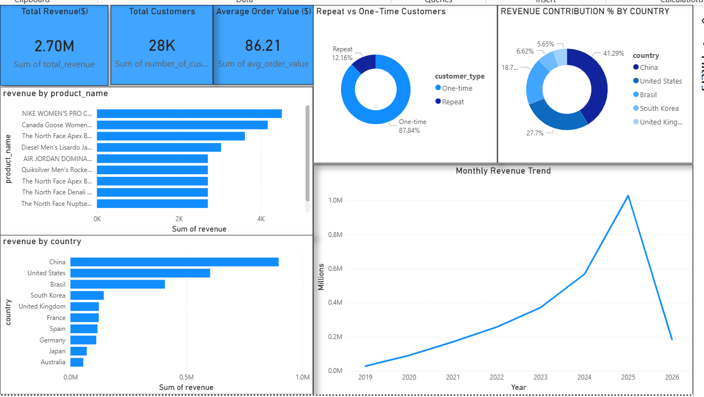

# 🛒 E-Commerce Sales & Customer Insights Analysis

> End-to-end e-commerce analysis on Google BigQuery's public dataset — uncovering revenue drivers, customer retention gaps, and geographic concentration using advanced SQL and Power BI.

[](https://cloud.google.com/bigquery)
[]()


---

## 📌 Project Summary

Most e-commerce businesses have revenue data — but few know *which products are carrying the business*, *where customer loyalty is breaking down*, or *which markets are underperforming*.

This project runs a full analyst workflow on a real-world BigQuery e-commerce dataset: SQL-based analysis across orders, products, customers, and geographies — then visualized in an interactive Power BI dashboard with actionable business recommendations.

**Bottom line:** Revenue is heavily concentrated in a handful of products and two countries. Repeat customers are a small share of the base — a major retention opportunity sitting untouched.

---

## 📊 Dashboard Preview



---

## 🎯 Business Questions Answered

| Question | Finding |
|---|---|
| How has revenue trended over time? | Steady growth followed by a recent decline — likely seasonality or data lag |
| Which products drive the most revenue? | Small product cluster accounts for disproportionate share — concentration risk |
| Which countries generate the highest revenue? | China and USA dominate; most other markets underperform |
| What is the average order value? | High AOV — strong pricing power exists |
| How many customers are repeat buyers? | Repeat buyers are a small % — significant retention gap |
| Is revenue too concentrated? | Yes — both by product and by geography |

---

## 🗂️ Project Structure

```
ecommerce-analysis/
│
├── sql_queries.sql          # All BigQuery SQL queries (rename from .sql.txt)
├── dashboard.pbix           # Power BI report file
├── dashboard_photo.png      # Dashboard screenshot
├── Bigquery.png             # BigQuery query screenshot
├── Insights_recomm.docx     # Full business insights & recommendations
└── README.md
```

---

## 📦 Dataset

- **Source:** Google BigQuery Public Dataset
- **Dataset:** `bigquery-public-data.thelook_ecommerce`
- **Tables Used:** `order_items`, `orders`, `products`, `users`
- **Scope:** Real e-commerce transactions with product details, customer info, and geographic attributes

---

## 🔄 Workflow

```
1. Data Exploration   →  BigQuery SQL — understand schema, row counts, nulls
2. Analysis           →  Revenue trends, product performance, geo distribution, retention
3. Export             →  CSV exports from BigQuery → Power BI
4. Dashboard          →  Interactive Power BI report with KPIs and segment views
5. Recommendations    →  Business-ready insights document
```

---

## 🛠️ Tech Stack

| Layer | Tools |
|---|---|
| Data Querying | Google BigQuery (Advanced SQL) |
| Data Visualization | Power BI Desktop |
| Data Export | CSV |
| Documentation | Microsoft Word |
| Version Control | Git, GitHub |

---

## 🔍 Key SQL Analyses

- Monthly and quarterly revenue trend queries
- Product-level revenue ranking and concentration analysis
- Country-level revenue distribution
- Customer segmentation — repeat vs. one-time buyers
- Average order value calculation
- Cohort-style retention analysis

---

## 📈 Key Insights

- Revenue grew steadily before a **recent period decline** — warrants investigation into seasonality or funnel drop-off
- **Top products are over-indexed** — a small SKU cluster drives a disproportionate share of total revenue, creating product concentration risk
- **China and USA** account for the majority of revenue; most other markets are significantly underperforming
- **Repeat buyers are a small share** of total customers — the retention funnel is leaking and loyalty programs are absent
- **Average order value is strong** — upsell and cross-sell opportunities exist but are not being captured

---

## 💡 Business Recommendations

1. **Launch a retention program** — loyalty rewards, post-purchase email sequences, and personalized offers targeted at one-time buyers to convert them into repeat customers
2. **Diversify the product portfolio** — mid-tier and emerging products need marketing investment to reduce revenue concentration risk
3. **Expand geographic reach** — underperforming markets need localized campaigns and pricing strategy reviews
4. **Investigate the revenue decline** — root cause analysis needed: is this a data lag, seasonal dip, or a structural funnel issue?
5. **Activate upsell and cross-sell** — high AOV customers are an underutilized asset; bundling and recommendations can increase revenue per order further

---

## 🔗 Connect

**Rakshitha Ravishankar** — Data & AI Analyst  
[](https://www.linkedin.com/in/rakshitha-ravishankar29/)
[](https://github.com/RAKSHITHA-RAVI)
